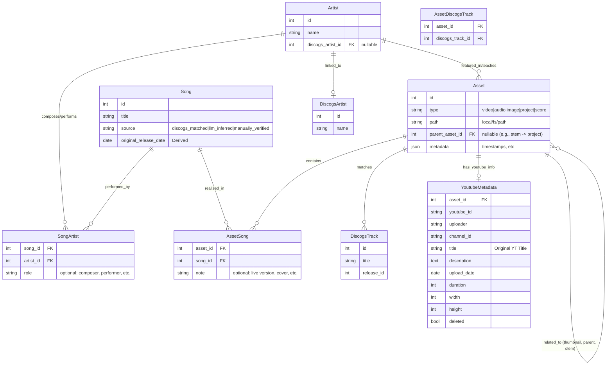

# Project Plan: Data Model Refactoring (Song, Asset, & Artist)

## Overview

Shift from a Video-centric model to a decoupled **Song, Asset, & Artist** model.

- **Song**: The abstract musical composition (Idea).
- **Artist**: The abstract musician or group (Entity).
- **Asset**: A concrete digital file or resource (Implementation).
- **DiscogsTrack**: A specific recording/instance on a release.

## Core Data Model

## Design Decisions

### Asset-to-Asset Hierarchy (Thumbnails & Stems)

Thumbnails are associated directly with the Video **Asset** (via `parent_asset_id`) rather than the `YoutubeMetadata`.

- **Pros**: Platform agnostic (works for local files/Vimeo), unified file management (one query for all related files), and decoupled from source-specific data.
- **Context**: The `metadata` JSON field on the child asset (type=image) defines its role (e.g., `{"role": "thumbnail"}`).

### Clip Asset Mechanics

Clips are "Pointer" assets that represent a segment of a larger source file.

- **Virtual Clips**: The asset has no `path` but contains `start_seconds` and `end_seconds` in its `metadata`. Tools (like players) resolve the parent path and apply the offset.
- **Physical Clips**: Assets that have been "materialized" (e.g., via FFmpeg) into their own files. They retain a `parent_asset_id` for lineage but have their own `path`.

## Use Cases & Requirements

The data model must support the following scenarios:

1.  **Composition Management**:
    - Add a Song "Brown Sugar" by "Rolling Stones" without any assets initially.
2.  **Asset Associations**:
    - A single **YouTube Video** (Asset) can be linked to:
      - A **Song** (e.g., "Brown Sugar").
      - A **DiscogsTrack** (e.g., Track A1 on Album X).
      - A **YoutubeMetadata** record (details below).
    - A **Thumbnail** (Asset, type=image) can be associated with a **YouTube Video** (Asset).
    - A **Record Cover** (Asset, type=image) can be associated with a **DiscogsTrack** (via Asset match).
    - A **Cover Version** (Asset) by another band can be linked to the original **Song** (Composition).
    - A **Video Lesson** (Asset) can be linked to the **Song** and a specific **Teacher/Channel**.
    - A **Clip** (Asset) defined by timestamps T1-T2 can be linked to a source **YouTube Video** (Asset).
3.  **Production Assets**:
    - **MusicXML** or **Scores** linked to a Song.
    - **Stems** (WAV files) linked to a parent Asset (e.g., a BitWig project).
      - _Clarification_: `parent_asset_id` is used here. If Asset A is a BitWig project, and Asset B is a stem used in it, Asset B has `parent_asset_id = A.id`.
    - **DAW Projects** (BitWig, Ableton) linked to constituent Assets.

## Implementation Phases

### Phase 1: Artist & Song Foundation (Combined)

**Goal**: Introduce Artist and Song entities together, populating from both Discogs matches and LLM inference.

0.  **Preparation**:
    - Create `tools db backup` command to ensure easy rollback during refactoring.

1.  **Schema Changes**:
    - Create `Artists` and `DiscogsArtist` tables (as defined in Core Model).
    - Create `Songs` table with `source` field (Enum: `discogs_matched`, `llm_inferred`, `manually_verified`).
    - Create `SongArtists` junction table.
    - Create `AssetSongs` (or temporary `VideoSongs`) junction table.
    - **Note**: Create a new Alembic migration for these changes to ensure consistency.

2.  **Migration Step A - Discogs-Linked Videos (High Confidence)**:
    - For Videos _with_ an existing `discogs_track_id`:
      - **Artist Creation**: Follow chain `Video -> DiscogsTrack -> Release -> DiscogsArtist`.
        - Create/Find `Artist` record linked to `DiscogsArtist`.
      - **Song Creation**: Create `Song` (Title=DiscogsTrack.title).
        - Link `Song` to `Artist` via `SongArtists`.
        - Link `Video` to `Song` via junction table.
        - Set `Song.source = 'discogs_matched'`.

3.  **Migration Step B - Orphan Videos (LLM Inference)**:
    - Develop `tools guess-songs` command using `LLMInferenceService` and `InferenceStrategy`.
    - For Videos _without_ a `discogs_track_id` (orphans):
      - Use `LLMInferenceService` with `title`, `description`, `uploader`.
      - Prompt: "Extract canonical Artist Name(s) and Song Title."
      - **Artist Creation**: Create new `Artist` record(s) with inferred name (no `DiscogsArtist` link yet).
      - **Song Creation**: Create `Song`.
        - Link `Song` to `Artist`s via `SongArtists`.
        - Link `Video` to `Song` via junction table.
        - Set `Song.source = 'llm_inferred'`.
    - **Note**: Do *not* migrate `Videos.uploader` directly to `Artist` (data is too noisy for direct migration).
    - **Command Migration**: Update `tools discogs` commands (refresh, postprocess, update) to support the new Song/Artist/Video junction schema.

4.  **Validation**:
    - Ensure all existing `tools playlist` and `tools discogs` commands function correctly.
    - Verify Artist and Song counts match expected values from Videos table.

### Phase 2: Song Manual Review

**Goal**: Verify AI guesses before moving to Discogs matching.

1.  **Develop `tools review songs`**:
    - Interactive CLI.
    - Selects `Songs` where `source = 'llm_inferred'`.
    - Displays: YouTube Title vs. Guessed Artist/Title.
    - Options: [C]onfirm, [E]dit, [S]kip, [D]elete.
    - On Confirm/Edit: Set `source = 'manually_verified'`.

### Phase 3: Discogs Enrichment (MCP/Service)

**Goal**: Connect the new Song/Artist entities to Discogs.

1.  **Schema Changes**:
    - Add `discogs_search_status` to `Artists` and `Songs` (Enum: `pending`, `searched_found`, `searched_missing`).
2.  **Develop `tools guess-discogs`**:
    - Uses Discogs API (or MCP server).
    - **Artists**: For `Artists` with no `DiscogsArtist`:
      - Search Discogs.
      - If high-confidence match found -> Store as candidate linkage.
    - **Songs**: For `Songs` with no `DiscogsTrack`:
      - Search Discogs for (Artist, Title).
      - If match found -> Store `discogs_track_id` as candidate linkage on the Song (or distinct candidate table).

### Phase 4: Discogs Manual Review

**Goal**: Finalize external links.

1.  **Develop `tools review discogs`**:
    - Interactive CLI.
    - Presents Candidate Matches from Phase 3.
    - User confirms or rejects the link.

### Phase 5: Full Asset Migration

**Goal**: Final transition to the `Asset` table (The "Big Switch").

1.  **Migrate Assets**:
    - Convert `Videos` -> `Assets` (type=video) + `YoutubeMetadata`.
    - Move `VideoSongs` links to `AssetSongs`.
2.  **Cleanup**:
    - Drop `Videos` table.
    - Drop legacy columns.

## Key Logic to Implement

- **Composition vs. Recording**: Distinguish between the abstract Song and the concrete DiscogsTrack.
- **Asset Hierarchy**: Support Assets derived from other Assets (clips, thumbnails).
