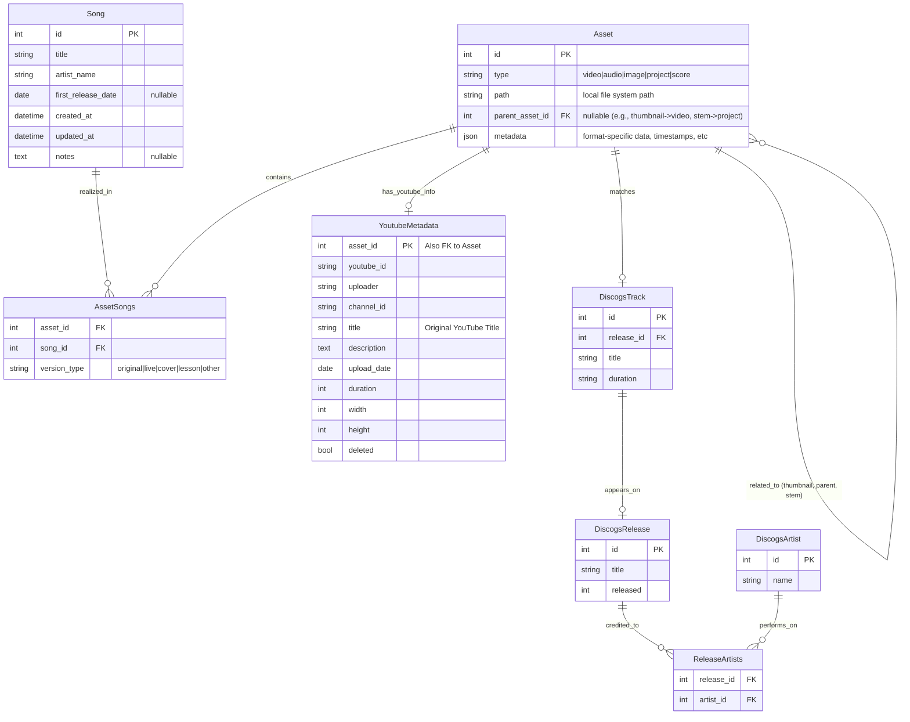

# Data Modeling Refactoring: Video-Centric to Song-Centric

## Overview

Transform yarkie from video-centric to song-centric data modeling to better support music learning. Core abstraction shifts from "YouTube videos" to "Songs/Pieces" with videos as one of many resources for learning.

**Why:** Current model treats videos as primary entities with optional Discogs enrichment. New model treats Songs as primary with multiple associated resources (videos, audio, scores, stems).

## Current State

- Videos table with `is_tune` flag (distinguishes music vs non-music)
- Optional `discogs_track_id` FK links videos to Discogs tracks
- Discogs tables: artist, release, track, release_artists
- No concept of "Song" as distinct from video or track

## Target Schema

### Intermediate Target (Phases 0-8)

This incremental refactoring maintains the Video table while adding Song abstraction:


**Key Design Decisions:**

- **Song is independent** - No direct FK to DiscogsTrack. Songs can exist without Discogs data (original compositions, non-commercial music)
- **Video retains discogs_track_id** - Backwards compatible, used to derive Song data during migration
- **VideoSongs join table** - Many-to-many relationship (concerts have multiple songs, songs have multiple videos)
- **artist_name in Song** - Denormalized for simplicity. Full Artist entity deferred to future phases

### Ultimate Target (Future Phases 9+)

The final architecture replaces Video with generic Asset abstraction:



**Ultimate Target Design Decisions:**

- **Asset abstraction** - Unifies videos, audio files, images, scores, DAW projects under single table
- **Platform agnostic** - YoutubeMetadata separate from Asset enables non-YouTube sources (Vimeo, local files)
- **Asset hierarchy** - `parent_asset_id` enables relationships: thumbnails→videos, stems→projects, clips→source
- **Flexible metadata** - JSON field accommodates format-specific data without schema changes
- **Migration path** - Videos table becomes Assets (type='video') + YoutubeMetadata in one-time migration

## Service Architecture

**Separation of Concerns:**

```
┌─────────────────────┐
│ DiscogsProcessor    │
│   process_video()   │  ← Orchestrates both services
└──────────┬──────────┘
           │
           ├─────────────────────┐
           │                     │
           v                     v
┌──────────────────┐   ┌──────────────────┐
│ DiscogsService   │   │ SongService      │
│  - search_*()    │   │  - find_or_      │
│  - save_*()      │   │    create_*()    │
│  (unchanged)     │   │  - link_song_    │
└────────┬─────────┘   └────────┬─────────┘
         │                      │
         v                      v
    ┌─────────────────────────────┐
    │ DiscogsRepository           │
    │ SongRepository              │
    └─────────────────────────────┘
```

**Key Points:**

- **DiscogsService**: Handles Discogs API interactions and Discogs entity management (unchanged)
- **SongService**: Handles Song business logic, queries DiscogsRepository directly (no service-to-service coupling)
- **DiscogsProcessor**: Integration point - orchestrates both services during video processing
- **Clean layering**: Repository ← Service ← Processor ← Command

### Asset-to-Asset Hierarchy (Thumbnails & Stems)

Thumbnails are associated directly with the Video **Asset** (via `parent_asset_id`) rather than the `YoutubeMetadata`.

- **Pros**: Platform agnostic (works for local files/Vimeo), unified file management (one query for all related files), and decoupled from source-specific data.
- **Context**: The `metadata` JSON field on the child asset (type=image) defines its role (e.g., `{"role": "thumbnail"}`).

### Clip Asset Mechanics

Clips are "Pointer" assets that represent a segment of a larger source file.

- **Virtual Clips**: The asset has no `path` but contains `start_seconds` and `end_seconds` in its `metadata`. Tools (like players) resolve the parent path and apply the offset.
- **Physical Clips**: Assets that have been "materialized" (e.g., via FFmpeg) into their own files. They retain a `parent_asset_id` for lineage but have their own `path`.

## Use Cases & Requirements

The data model must support the following scenarios:

1.  **Simple videos**:
    - Add a Youtube video which is not related to a music composition, it's just a video asset
1.  **Composition Management**:
    - Add a Song "Brown Sugar" by "Rolling Stones" without any assets initially.
1.  **Asset Associations**:
    - A single **YouTube Video** (Asset) can be linked to:
      - A **Song** (e.g., "Brown Sugar").
      - A **DiscogsTrack** (e.g., Track A1 on Album X).
      - A **YoutubeMetadata** record (details below).
    - A **Thumbnail** (Asset, type=image) can be associated with a **YouTube Video** (Asset).
    - A **Record Cover** (Asset, type=image) can be associated with a **DiscogsTrack** (via Asset match).
    - A **Cover Version** (Asset) by another band can be linked to the original **Song** (Composition).
    - A **Video Lesson** (Asset) can be linked to the **Song** and a specific **Teacher/Channel**.
    - A **Clip** (Asset) defined by timestamps T1-T2 can be linked to a source **YouTube Video** (Asset).
1.  **Production Assets**:
    - **MusicXML** or **Scores** linked to a Song.
    - **Stems** (WAV files) linked to a parent Asset (e.g., a BitWig project).
      - _Clarification_: `parent_asset_id` is used here. If Asset A is a BitWig project, and Asset B is a stem used in it, Asset B has `parent_asset_id = A.id`.
    - **DAW Projects** (BitWig, Ableton) linked to constituent Assets.

## Implementation Plan

### Phase 0: Preparation (High Priority)

**Goal:** Set up infrastructure for safe refactoring

**Subtasks:**

1. Create `tools db backup` command

   - Creates timestamped database backups
   - Ensures easy rollback during refactoring
   - **Complexity:** Low

2. Create `tools video add` command
   - Add individual videos explicitly (alternative to `tools playlist refresh`)
   - **Clarification:** Supports adding videos without requiring Discogs data initially; marks as `is_tune=True` (or False) for later processing.
   - When Song integration is ready (Phase 2, Subtask 4), automatically creates Song from Discogs metadata
   - **Reasoning:** Makes video addition explicit and prepares for Song integration
   - **Complexity:** Low

**Integration:** Foundational commands for safe development.

**Blockers:** None

### Phase 1: Introduce Song Entity (High Priority)

**Goal:** Add Song table without breaking existing functionality

**Subtasks:**

1. Create Song model and table

   - id (PK), title, artist_name, first_release_date, created_at, updated_at, notes (nullable)
   - **Unique Constraint:** (artist_name, title) to ensure idempotency and prevent duplicates
   - **NO FK to DiscogsTrack** - Song is independent entity that may be derived from Discogs data
   - **Reasoning:** Songs can exist without Discogs data (original compositions, non-commercial music)
   - **Complexity:** Low - straightforward schema

2. Add video_songs join table (many-to-many)

   - song_id, video_id, version_type (enum: 'original', 'live', 'cover', 'lesson', 'other')
   - version_type defaults to 'other' on creation, populated later in Phase 4
   - **Reasoning:** Videos can contain multiple songs (concerts), songs have multiple videos
   - **Complexity:** Low

3. Create alembic migration

   - Add tables, maintain existing columns
   - **Dependency:** Subtask 1-2 complete

4. Create database indexes in migration
   - UNIQUE index on (artist_name, title)
   - songs.title, songs.artist_name (search performance)
   - video_songs.song_id, video_songs.video_id (join performance)
   - **Complexity:** Low

**Integration:** New tables coexist with existing schema. No changes to services/commands yet.

**Blockers:** None

### Phase 2: Song Creation Service (High Priority)

**Goal:** Service to create/update songs from Discogs data and manual input

**Subtasks:**

1. Create SongRepository (CRUD operations)

   - find_by_artist_and_title(artist, title) -> Optional[Song]
   - create(song_data) -> Song
   - update(song_id, updates) -> Song
   - **Deduplication:** Ensures only ONE song per unique (artist, title, first_release_date) combination
   - **Pattern:** Follow existing repository pattern (base_repository.py)
   - **Complexity:** Low

2. Create SongService

   - find_or_create_from_discogs(track_id: int) -> Song
     - Queries DiscogsRepository (NOT DiscogsService) for track data
     - Follows FK chain: Track → Release → ReleaseArtists → Artist
     - Finds oldest track with same artist/title across releases
     - Creates Song with extracted data (title, artist_name, first_release_date)
     - Uses find_or_create pattern via SongRepository to prevent duplicates
   - create_song_manual(title: str, artist: str, date: str, notes: str) -> Song
     - For music videos without Discogs data
     - Manual song creation workflow
   - link_song_to_video(song_id: int, video_id: str, version_type: str) -> None
     - Creates video_songs junction record
   - **Dependencies:** DiscogsRepository (data queries), SongRepository (CRUD)
   - **Pattern:** Service coordinates across repositories, no service-to-service calls
   - **Reasoning:** Maintains clean separation - SongService reads Discogs data but doesn't control Discogs operations
   - **Complexity:** Medium - requires Discogs FK traversal logic

3. Create song_from_video(video_id) workflow

   - If video.discogs_track_id exists: create song, link video
   - **Complexity:** Low
   - **Dependency:** Phase 1 complete

4. Integrate song creation into DiscogsProcessor workflow
   - In DiscogsProcessor.\_save_metadata(), after save_track() succeeds:
     1. Call SongService.find_or_create_from_discogs(track_id)
     2. Call SongService.link_song_to_video(song_id, video_id, 'other')
   - Add SongService as DiscogsProcessor dependency (constructor injection)
   - Ensures new videos get songs immediately during postprocess
   - **Integration Point:** DiscogsProcessor orchestrates both DiscogsService and SongService
   - **Complexity:** Low - simple method call insertion
   - **Dependency:** Subtask 1-2 complete

**Integration:** Services ready and integrated into discogs workflow.

**Blockers:** None

### Phase 3: Backfill Existing Data (High Priority)

**Goal:** Migrate existing video->track relationships to song model

**Subtasks:**

1. Create migration command: `tools song backfill`

   - Query all videos with discogs_track_id
   - **Dry Run:** Support `--dry-run` flag to preview migration counts without DB writes
   - For each video with discogs_track_id:
     1. Call SongService.find_or_create_from_discogs(track_id)
     2. Create video_songs entry with version_type='other'
     3. Set migrated_to_song=True
   - **Note:** No search needed - discogs_track_id already known
   - **Deduplication:** Multiple videos linking to same track share one song entity
   - **Reasoning:** Preserves existing Discogs relationships
   - **Complexity:** Medium - needs transaction handling

2. Add flag to videos table: `migrated_to_song` (Boolean)

   - Track migration status
   - **Complexity:** Low

3. Create report: videos with is_tune=True but no song

   - Identifies music videos without Discogs data
   - **Complexity:** Low
   - **Dependency:** Subtask 1 complete

4. Create workflow for is_tune=True videos without discogs_track_id
   - Identifies music content that needs manual song creation
   - Provides command to manually create and link songs
   - **Complexity:** Medium

**Integration:** Existing video commands unchanged. Run migration manually.

**Blockers:** Requires manual validation before production.

### Phase 4: LLM/MCP Inference for Orphan Videos (Mid Priority)

**Goal:** Use LLM or MCP to extract song metadata from videos without Discogs data

**Subtasks:**

1. Create LLMInferenceService with InferenceStrategy pattern

   - Support multiple backends: OpenWebUI, Gemini, Claude API, MCP servers
   - Prompt: "Extract canonical Artist Name and Song Title from: title, description, uploader"
   - Returns structured data: {artist: str, title: str, confidence: float}
   - **Pattern:** Strategy pattern for swappable LLM backends
   - **Complexity:** Medium

2. Develop `tools song guess` command

   - For videos with is_tune=True but no discogs_track_id (orphans)
   - Uses LLMInferenceService to extract artist/song info
   - Creates Song via SongService.create_song_manual()
   - Links to video with version_type='other'
   - Adds note field indicating "llm_inferred" source
   - **Note:** Do NOT migrate Videos.uploader directly to Song (data too noisy)
   - **Complexity:** Medium
   - **Dependency:** Phase 2 complete (SongService exists)

3. Create `tools song review-inferred` command

   - Interactive CLI for manual review of LLM-inferred songs
   - Displays: YouTube Title vs. Guessed Artist/Title
   - Options: [C]onfirm, [E]dit, [S]kip, [D]elete
   - Updates Song.notes to indicate manual verification
   - **Complexity:** Low
   - **Dependency:** Subtask 2 complete

4. Develop `tools song enrich-discogs` (optional MCP integration)
   - For manually-created songs without Discogs links
   - Uses Discogs API or MCP server to search for matching tracks
   - Suggests candidate matches with confidence scores
   - User confirms matches interactively
   - Updates Song metadata with Discogs-derived data
   - **Note:** Does NOT create FK to DiscogsTrack (Song remains independent)
   - **Complexity:** Medium

**Integration:** Optional enhancement for videos without Discogs metadata. Works alongside manual song creation.

**Blockers:** Requires LLM/MCP infrastructure setup.

### Phase 5: Song Versions (High Priority)

**Goal:** Handle multiple versions of same song

**Subtasks:**

1. Add version detection to SongService

   - Compare duration between video and discogs track
   - Threshold: >10% difference = different version
   - **Reasoning:** Per requirements - "different recordings, not repackages"
   - **Complexity:** Medium

2. Update video_songs.version_type based on video metadata
   - Use video title keywords: "live", "cover", "lesson", "tutorial"
   - **Complexity:** Low

**Integration:** Enhances Phase 2 services. No command changes.

**Blockers:** None

### Phase 6: Audio Files (Mid Priority)

**Goal:** Support audio files as Song resources

**Subtasks:**

1. Create AudioFiles table

   - id, song_id (FK), file_path, duration, format, stem_type (enum: 'full', 'bass', 'drums', 'vocals', 'other')
   - **Reasoning:** Parallels video structure, supports stems requirement
   - **Complexity:** Low

2. Create AudioFileRepository and basic CRUD service

   - **Pattern:** Mirror video repository pattern
   - **Complexity:** Low

3. Add command: `tools song add-audio <song_id> <file_path>`
   - **Complexity:** Low
   - **Dependency:** Phase 1-2 complete

**Integration:** New domain, no impact on existing video/song workflows.

**Blockers:** None

### Phase 7: Other File Types (Mid Priority)

**Goal:** Support scores, DAW projects

**Subtasks:**

1. Create generic ResourceFiles table

   - id, song_id (FK), file_path, file_type (enum: 'musicxml', 'pdf', 'garageband', 'bitwig', 'other')
   - **Reasoning:** Flexible schema for various file types
   - **Complexity:** Low

2. Create ResourceFileRepository

   - **Complexity:** Low

3. Add command: `tools song add-resource <song_id> <file_path> <type>`
   - **Complexity:** Low

**Integration:** Independent module. No changes to existing code.

**Blockers:** None

### Phase 8: Command Integration (High Priority)

**Goal:** Update existing commands to work with Song model

**Subtasks:**

1. Update `tools video` commands to show song associations

   - Display linked songs in search results
   - **Complexity:** Low
   - **Dependency:** Phase 3 complete (data migrated)

2. Create `tools song` command group
   - search, show, link, unlink subcommands
   - **Complexity:** Medium

**Integration:** Gradual rollout. Video commands work with/without songs.

**Blockers:** Requires thorough testing.

**Note:** Discogs postprocess integration completed in Phase 2, Subtask 4.

### Future Phases (Low Priority, Not Detailed)

**Phase 9: Asset Migration**

- Migrate Videos table to Asset abstraction
- Create YoutubeMetadata table and migrate YouTube-specific fields
- Convert VideoSongs to AssetSongs
- Enable Asset-to-Asset relationships (thumbnails, clips)
- One-time data migration with rollback capability

**Phase 10: Extended Asset Types**

- Multiple songs per asset (concerts, compilations)
- Non-YouTube video sources (Vimeo, local files)
- Full audio/image/score/project file support via Asset type field

**Phase 11: Artist & Channel Tracking**

- Separate Artist entity (denormalize artist_name from Song)
- Channel/Teacher tracking for lesson videos
- Artist-Song relationships (composers, performers)

## Critical Dependencies

1. Phase 1 depends on Phase 0 (backup/add commands ready)
2. Phase 2 depends on Phase 1 (schema exists)
3. Phase 3 depends on Phase 2 (services exist)
4. Phase 4 depends on Phase 2 (SongService exists for manual creation)
5. Phase 8 depends on Phase 3 (data migrated)
6. Phases 5, 6-7 independent, can proceed in parallel
7. Phase 2, Subtask 4 (discogs integration) should complete before significant new video processing

## Constraints

- Must maintain backwards compatibility during transition
- Discogs API rate limits (1 req/sec)
- SQLite-specific alembic migrations
- Existing video downloads must remain accessible

## Testing Strategy

- Unit tests for repositories (follow patterns in tests/tools/data_access/)
- Unit tests for services (follow patterns in tests/services/)
- Integration tests for commands (follow patterns in tests/commands/)
- Integration test for backfill migration with sample data
- Manual QA on sample data before production migration
